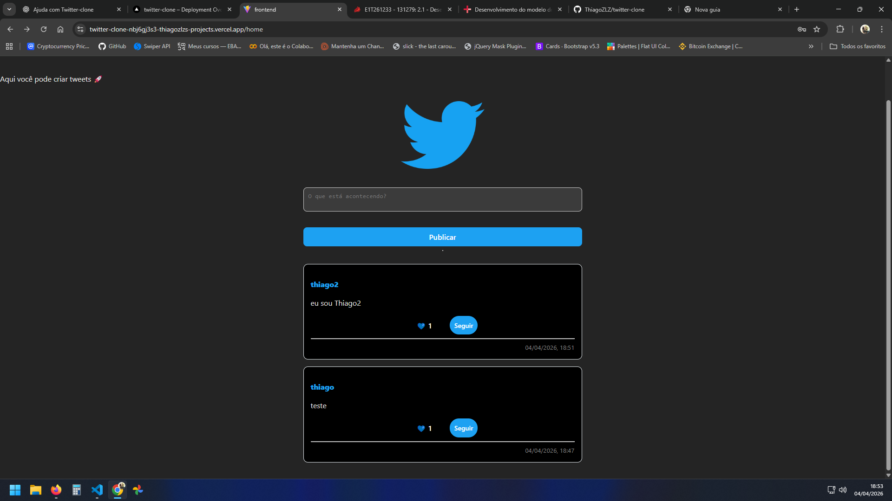
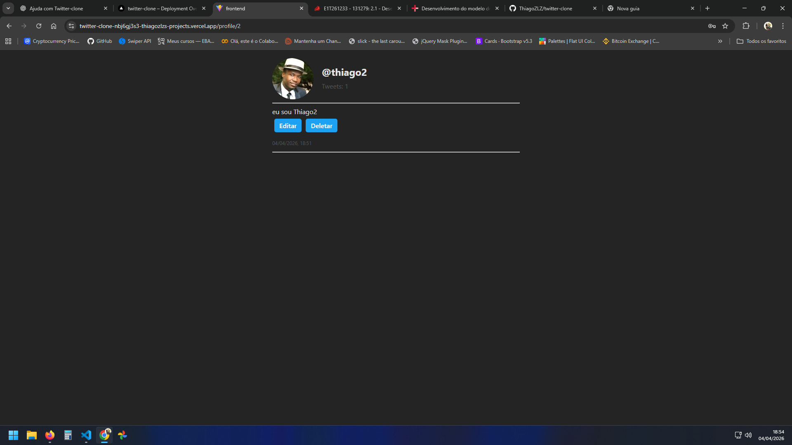

# 🐦 Twitter Clone

Aplicação full-stack inspirada no Twitter, desenvolvida com foco em aprendizado e prática de desenvolvimento web moderno. O projeto permite criação de usuários, autenticação, publicação de tweets, interação entre usuários e edição de perfil.

---

## 🚀 Tecnologias utilizadas

### 🔹 Frontend

* React
* TypeScript
* Styled-components
* Axios

### 🔹 Backend

* Python
* Django
* Django REST Framework
* JWT Authentication

### 🔹 Banco de dados

* SQLite (ambiente de desenvolvimento)

### 🔹 Deploy

* Frontend: Vercel
* Backend: Render

---

## ✨ Funcionalidades

* 🔐 Cadastro e login com autenticação JWT
* 📝 Criação, edição e exclusão de tweets
* ❤️ Curtir tweets
* 👥 Seguir e deixar de seguir usuários
* 🧑‍💻 Página de perfil com lista de tweets
* 🔄 Feed personalizado
* 🔒 Proteção de rotas

---

## 🌐 Acesse o projeto

👉 Frontend:
https://twitter-clone-nbj6gj3s3-thiagozlzs-projects.vercel.app/profile/1

👉 Backend (API):
https://twitter-clone-vdtf.onrender.com/api/

---

## 📸 Preview




---

## ⚙️ Como rodar o projeto localmente

### 🔹 Backend

```bash
cd Backend
python -m venv venv
venv\Scripts\activate  # Windows

pip install -r requirements.txt
python manage.py migrate
python manage.py runserver
```

---

### 🔹 Frontend

```bash
cd Frontend
npm install
npm run dev
```

---

## 🔧 Variáveis de ambiente

### Backend (Render)

* `SECRET_KEY`
* `DEBUG`

### Frontend (Vercel)

* `VITE_API_URL`

---

## ⚠️ Observações

* O backend está hospedado no Render (plano gratuito), podendo levar alguns segundos na primeira requisição.
* Upload de imagens pode não ser persistente em produção devido às limitações do ambiente gratuito.

---

## 🎯 Objetivo do projeto

Este projeto foi desenvolvido com o objetivo de:

* Praticar desenvolvimento full-stack
* Trabalhar com autenticação JWT
* Integrar frontend e backend
* Realizar deploy em ambiente real
* Criar uma aplicação completa para portfólio

---

## 📌 Melhorias futuras

* Melhorar UI/UX
* Implementar sistema de notificações
* Adicionar paginação mais avançada
* Upload de imagens com armazenamento externo (ex: Cloudinary)
* Responsividade completa

---

## 👨‍💻 Autor

Desenvolvido por Thiago Carvalho

---

## 📄 Licença

Este projeto está sob a licença MIT.
